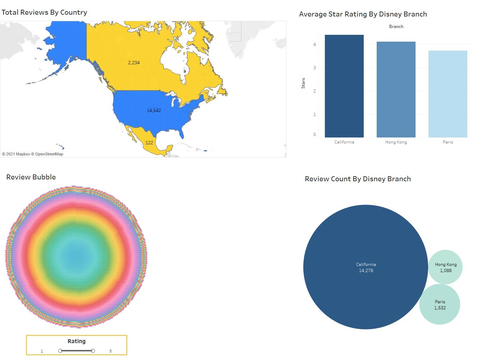
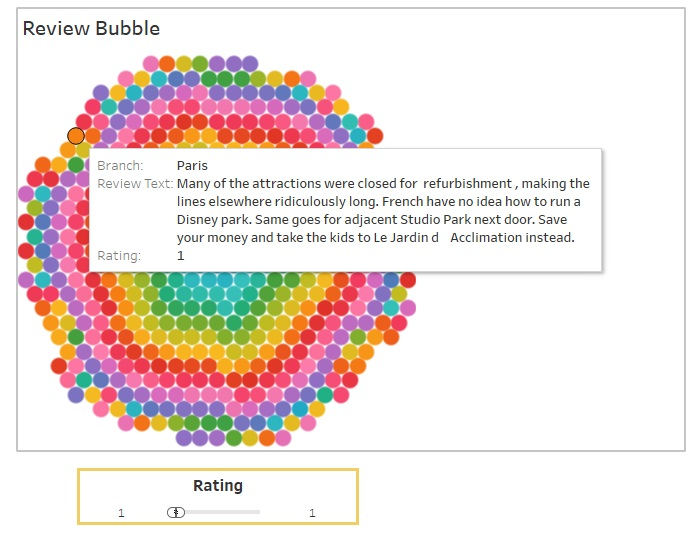

# disneyland-project
Data source: [Disneyland Reviews](https://www.kaggle.com/arushchillar/disneyland-reviews)

# Introduction
This data set consisted of Disneyland reviews for three separate branches of Disneyland, those being Paris, Hong Kong, and California. I was tasked with creating a dashboard that explored the dataset and showed any interesting findings. For this project I used Tableau.
# Walkthrough

 1. Total Reviews By Country: The top-left chart shows the reviews by country for the different branches of Disneyland. For clarity, I used only reviews that were from Canada, United States, and Mexico.

 2. Average Star Rating By Disneyland Branch: The top-right chart shows the average star rating for each branch of Disneyland. California has the highest average review score, with Hong Kong being a close second.

 3. Review Bubble: The bottom left chart allows you to filter reviews by star rating with the rating slider at the bottom. Each bubble has the branch, review text, and star rating connected. This way you can find out what reviewers have to say about each Disneyland branch.

 

 5. Review Count By Disney Branch: The bottom right chart is a bubble chart showing the review counts by each Disney branch. The California branch has a lot more reviews than any of the other locations which leads me to assume that the California location has been around for a longer period of time.